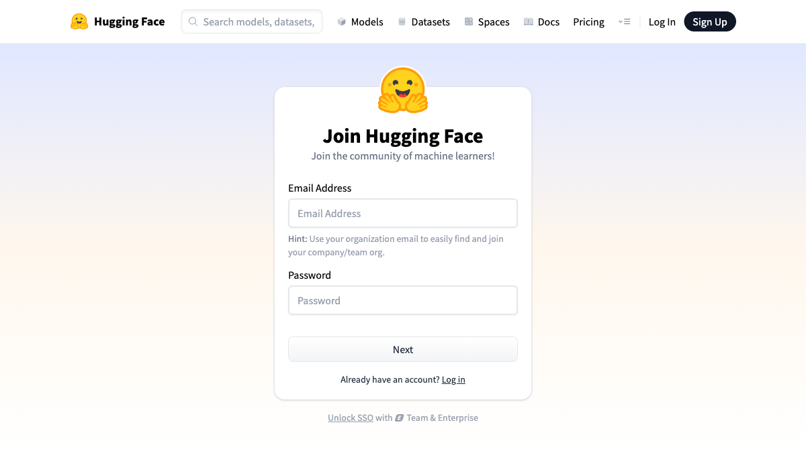
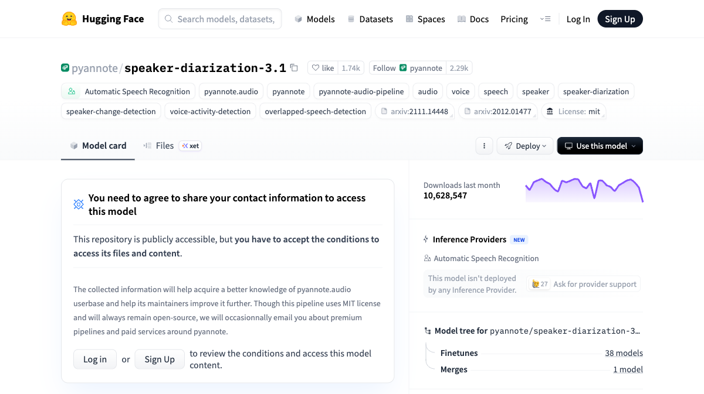
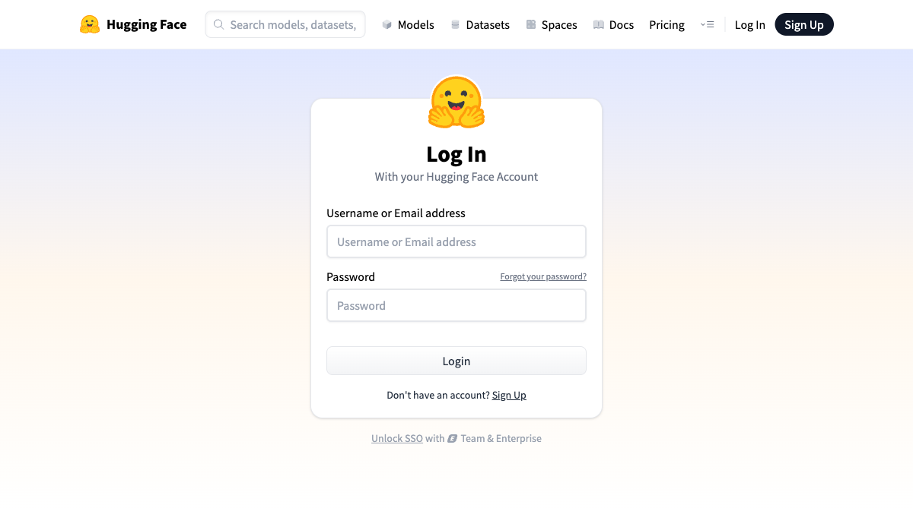

# 文字起こしツール セットアップ手順書

所要時間：**約30〜40分**（初回のみ）

---

## 事前確認

- Apple Silicon Mac（M1 / M2 / M3 / M4）を使っていること
- メモリ 8GB 以上
- インターネットに接続していること

---

## STEP 1：HuggingFace のアカウントを作る

文字起こしに必要な「話者分離（誰が話しているか判別）」機能のために、HuggingFace というサービスのアカウントが必要です。

1. ブラウザで **https://huggingface.co/join** を開く



2. メールアドレスとパスワードを入力して「Next」をクリック
3. 届いたメールの認証リンクをクリックして登録完了
4. ログインした状態にしておく（次のステップで必要）

---

## STEP 2：モデルの利用規約に同意する

> ⚠️ **必ずログインした状態**で行ってください。ログインしていないと同意が無効になります。
> ⚠️ 同意するモデルは **community-1** です（旧 3.1 ではありません）。URL を間違えると話者分離が動きません。

1. **ログインしたまま** **https://huggingface.co/pyannote/speaker-diarization-community-1** を開く



2. 「**Log in**」ボタンをクリック（すでにログイン済みであれば同意フォームが表示される）
3. 名前・会社名などの入力フォームが出たら適当に入力してOK
4. 「**I agree to share my contact information with pyannote**」にチェックを入れて送信
5. ページが更新されてモデルの内容が表示されたら同意完了

---

## STEP 3：アクセストークンを発行する

1. **https://huggingface.co/settings/tokens** を開く



   ※ ログイン画面が出た場合はログインしてから進む

2. 「**New token**」ボタンをクリック
3. 以下のように設定する：
   - **Name（名前）**：なんでもOK（例：`whisper-tool`）
   - **Type（種類）**：`Read` を選択
4. 「**Generate a token**」をクリック
5. `hf_` で始まる文字列が表示される → **必ずコピーしてメモ帳などに貼り付けておく**

> ⚠️ このトークンはこの画面を閉じると二度と表示されません。必ずコピーしてください。

---

## STEP 4：ターミナルでダウンロード＆インストール

1. Dock またはアプリケーションフォルダから「**ターミナル**」を起動する
2. 以下を**まとめてコピー**してターミナルに貼り付け、**Enter** を押す：

```
git clone https://github.com/koumatsudo-jpg/whisper-tool-.git
cd whisper-tool-
bash install.sh
```

3. 途中でポップアップが出たら「**インストール**」をクリック（Xcode ツールのインストール）

4. 「トークンを貼り付けてください」と表示されたら、STEP 3 でコピーした `hf_...` を貼り付けて **Enter**

5. 「**セットアップ完了！**」と表示されたら終わり

> インストール全体で **10〜20分** かかることがあります。そのまま待ってください。

### install.sh が入れるもの（参考）

| パッケージ | 用途 |
|---|---|
| torch | AI エンジン（pyannote 用）|
| mlx-whisper | 文字起こし（Apple Silicon 最適化）|
| pyannote.audio | 話者分離 |
| customtkinter | GUI |
| tkinterdnd2 | ドラッグ＆ドロップ |
| psutil | メモリ自動判定（軽量モード）|

---

## STEP 5：初回起動（モデルのダウンロード）

1. デスクトップの「**文字起こし.command**」をダブルクリック
2. ターミナルが開き、自動でAIモデルのダウンロードが始まります
3. **約800MB・5〜10分**かかります。止まったように見えても待ってください
   - モデルは `~/.cache/huggingface/hub/` にキャッシュされます
4. ダウンロードが終わると自動でツールの画面が開きます

> 2回目以降はすぐに起動します（ダウンロードは初回のみ）

---

## STEP 6：基本の使い方

1. 「文字起こし.command」をダブルクリックして起動
2. 動画・音声ファイルをウィンドウにドラッグ＆ドロップ（複数まとめてOK）
3. 必要に応じて各モード・モデルを選択（→ [利用マニュアル](利用マニュアル.md) 参照）
4. 「文字起こし開始」をクリックして待つ
5. 完了すると、元の動画と同じ場所に `_文字起こし.txt` が保存される

詳しい機能説明・モード選択のコツは **[利用マニュアル](利用マニュアル.md)** を参照してください。

---

## よくあるトラブル

### Q. 「開発元が未確認のため開けません」と出る
→ 右クリック → 「開く」→「開く」で起動できます。

### Q. インストール中にエラーが出て止まった
→ エラーのメッセージをスクリーンショットで送ってください。

### Q. トークンを忘れた / 間違えた
→ https://huggingface.co/settings/tokens で新しいトークンを発行して、`install.sh` を再実行してください。

### Q. 初回起動でずっと動いている
→ モデルのダウンロード中です。Wi-Fi環境で10分ほど待ってください。キャンセルしたい場合はターミナルで Ctrl+C を押してください。

### Q. 起動途中で `ModuleNotFoundError: No module named '_tkinter'` と出て止まる
→ `brew install python-tk@3.11` を実行してから `./install.sh` を再実行してください。

### Q. 8GB Mac を使っている
→ 起動時に自動で「軽量モード」が ON になります。詳細は [利用マニュアル](利用マニュアル.md) を参照。

### Q. 「HF_TOKEN がない」と警告が出る
→ 警告なので無視して OK（レート制限がゆるくなるだけで、モデルDL自体は成功します）。

---

*困ったことがあれば連絡してください。*
